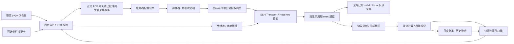

# 小鸡监控（vps-monitor）技术实施规范

版本：1.1 · 已核验平台契约与受管 SSH 运行时实施基线  
日期：2026-10-08  
负责人：Sol 架构师  
实施对象：Gemini 编码工程；验收对象：Luna 质检测试

## 1. 结论与不可突破的边界

逻辑架构采用「Hana App 生命周期 + SSH 采集服务 + 每机一条 SSH 连接 + 固定只读短命令 + 本地指标账本 + page 仪表盘」。**当前 Hana 不能在默认 AppHost 内直接建立 SSH socket，也没有逐目标原生 TCP 宿主授权接口；因此原约束不能全部同时兑现，M0 必须先解决网络门禁，不能直接宣称可发布。**远端不安装软件、不新增监听端口、不创建文件、不留下常驻采集进程；只使用已存在的 SSH 服务与系统命令。App 暂定唯一 ID 为 `vps-monitor`，显示名为「小鸡监控」。

SSH 实现选 Node `ssh2` 而非调用系统 `ssh`：前者便于控制连接、指纹、exec 通道、超时、密码与代理 socket；后者存在各平台二进制差异、凭据交互与子进程管理成本。该库只能放入获准的受管采集服务或未来正式 TCP 网关后端，不能放进默认 AppHost 裸拨号。

架构决策 ADR-001：严格的逐目标宿主 TCP 授权契约仍未由 Hana 提供，不能宣称已满足原约束。**本次依据催花清雨“修复 B1 并配置 SSH 连接”的明确要求，接受候选方案的安全边界变更：使用官方 `ctx.runtime.start` 的 `scoped` + `external` 受管 Node sidecar、`app/runtime.network` 粗粒度宿主授权与应用内目标 allowlist。** 该方案不在默认 AppHost 裸拨号，不使用系统 `ssh`，但应用内 allowlist 不是宿主强制的逐目标隔离；权限撤销、sidecar 失败或目标校验失败必须显式报错，不得回退到裸 socket、`native` 或 `local-machine`。跨平台 native 增加读取范围与额外权限，不能未经决策作为默认降级。

以下为产品真实能力边界，不得通过文案或实现掩盖：

| 宣称 | 可交付的精确定义 |
|---|---|
| Agentless / 零安装 | 无需远端安装探针；每次采样仍短暂启动非交互 shell、cat、df 等进程，会消耗少量 CPU 与带宽 |
| 存活 | SSH 服务从当前 Hana 网络路径的可达性，不是 ICMP 存活，也不是业务 HTTP 健康 |
| RTT | 首期显示「SSH 请求延迟」：本地请求至远端标记返回的耗时，包含服务端调度；不包装成精确网络 RTT |
| 月度流量 | Linux 网卡计数器观测账本，不是服务商账单；断采、重启、接口重建、跨周期时存在无法恢复的缺口 |
| 普通账号 | 默认 Debian 12 的普通账号可读取目标文件；hidepid、容器、加固策略、挂载权限可造成部分不可用 |
| 本地安全 | 凭据不进入 UI 回包、日志、Agent 工具、遥测；本地密文不等于可防已控制本机用户权限的攻击者 |
| 后台持续 | Hana/App 后台存活、系统未休眠且已解锁时采集；退出 Hana、休眠或停止 App 后不保证连续采样 |
| 纯 IPv4 访问 IPv6 | 代理必须能出站访问 IPv6；一个本地 IPv4 代理端口本身不自动赋予 IPv6 连通性 |

首期面向两台 Debian 12 VPS，但内核指标解析以字段名与计数器定义为契约，不绑定发行版与 CPU 厂商。不访问外部探针、SaaS 或服务商 API；不需要新增服务端防火墙规则、反向代理或 TLS 证书。

## 2. 范围、默认值与配置

### 2.1 功能优先级

- 必须：服务器 CRUD、密码/私钥认证、首次主机指纹确认、非 root 采集、CPU/负载/内存/SWAP/磁盘/网络、SSH 可达状态、月配额与重置日、纯白 page 仪表盘、连接重试、加密凭据与删除清理。
- 必须：所有统计指标携带有效性，认证失败和数据不足不得显示为 0；历史数据必须显示更新时间与 stale 状态。
- 增强：侧栏摘要、SOCKS5/HTTP CONNECT、按可见性降低采样频率、接口选择、高级账本审计。
- 不做：远端探针部署、自动提权、sudo、业务端口扫描、远程终端、文件上传、命令编辑器、SSH 转发、跳板服务器多级链、服务商账单同步、root 权限修复。

### 2.2 首期目标资料

| 名称 | 已知系统与资源 | 默认配额提示 |
|---|---|---|
| 云悠洛杉矶 | Debian 12，AMD，1 GiB 内存、2 GiB SWAP，标称 500M 带宽 | 月 1 TB，计费单位/统计方向/重置日需配置确认 |
| DediOne 洛杉矶 | Debian 12，1C1G，标称 1 Gbps 带宽 | 月 1 TB，计费单位/统计方向/重置日需配置确认 |

以上不是凭据或真实主机配置：不得猜 IP、端口、账号、时区和月重置日。内存以系统实测为准；标称带宽仅作配置展示，不由链路测速反推。

### 2.3 配置契约

`ServerConfig`：

- `id`：UUID，所有后台操作与 UI 订阅以 ID 索引；禁止用用户输入组成存储路径。
- `revision`：单调递增配置版本，修改请求用 expectedRevision 避免并发覆盖。
- `name`、`host`（DNS/IPv4/裸 IPv6）、`port`（默认 22）、`username`。
- `authKind: password | privateKey`、`credentialRef`；公开 DTO 只暴露 authKind/hasCredential，不暴露 credentialRef 或秘密。
- `hostKey`：已确认的算法、公钥 blob 与 SHA256 指纹，未确认为 null；支持用户显式替换，不允许自动覆盖。
- `proxyRef: null | UUID`；代理配置单独存储，密码独立凭据引用。
- `networkSelection: auto | explicit`；`interfaceNames[]` 仅用于本地过滤，绝不插入远端 shell。
- `quotaBytes: decimal string | null`、`quotaDirection: rx | tx | sum`、`resetDay: 1..31`、`billingTimeZone: IANA timezone`。
- `enabled`、`sampleIntervalMs`；SSH 密钥 passphrase 与密码只从写入通道接收。

默认：前台 5 s、后台 30 s；同机不重叠；全局并发采集 4、并发建连 2；建立连接最长 15 s；exec 最长 8 s；单次输出上限 256 KiB；SSH keepalive 30 s、失败阈值 3。以上为初始可调值，不是性能实测承诺。

首期只支持单个 PEM/OpenSSH 私钥文件和可选 passphrase，运行时支持的加密算法需 M0 验证。首期不支持 keyboard-interactive、2FA、证书认证与 ssh-agent：遇到这些认证策略明确报不支持，不自动多次试密码。

## 3. 系统结构与模块边界



| 模块 | 唯一职责 | 不得承担 |
|---|---|---|
| AppLifecycle | activate/deactivate、注册路由、恢复状态、释放资源 | UI 组件 mount 驱动全局采集 |
| ServerRepository | 非秘密配置、版本、迁移、删除事务 | 明文密码、拼接 shell |
| CredentialVault | 加密、解锁、引用、最小范围取用、删除 | 向 UI/Agent 回传密码、托管网络调用 |
| EgressPolicy | 精确目标/代理批准、DNS 策略、撤销联动 | 以静态通配符规避审批 |
| ConnectionManager | 每机一条 SSH 连接、指纹、认证、通道/超时/清理 | 接收任意用户命令 |
| Collector | 固定命令、输出限额、采样时序、单通道执行 | 解析统计、月度记账 |
| ProcParser | 版本化分帧，纯函数解析，字段校验 | 网络 IO、读取密钥、隐式补 0 |
| MetricsReducer | 同 boot/interface 基线差分，有效性 | 修改远端、账单推断 |
| TrafficLedger | 幂等增量、周期归属、未知区间、持久化恢复 | 从曲线积分伪造未采样流量 |
| SnapshotStore/EventBus | 原子快照、节流、seq、订阅恢复 | 共享密码、制造第二个采集器 |
| Dashboard/Sidebar | 公共 DTO 呈现、交互与取消订阅 | SSH socket、文件读取、计费逻辑 |

### 3.1 技术基线

- 后台：TypeScript，严格类型；默认 AppHost 仅控制生命周期、路由与宿主授权，采集/Vault/账本位于逻辑服务层。实际落位取决于 ADR-001：未来宿主 TCP 网关可由 AppHost 控制；候选受管方案将采集引擎及本地仓库放在唯一 sidecar，由 AppHost 受控转发。
- 候选 sidecar 只监听随机/可配置的本机回环端口；内部 API 要求每次运行生成的高熵 bearer，不信任仅凭 localhost 的请求。不在 stdout、日志或 URL 暴露 token，使用正式私有 IPC/经核验的安全启动传递渠道。`ctx.runtime.fetch` 转发时携带内部认证；无安全传递渠道则保持门禁，不用明文秘密环境变量或启动参数凑合。
- SSH：`ssh2`，锁定版本并扫描依赖；打包 Node 依赖，不依赖远端 npm/python。
- 前端：平台 page 容器内的 TypeScript 页面；框架跟 Hana 官方模板保持一致，不为监控引入大型图表依赖。
- 存储：数据仓库可插拔。首期使用 `sdk.dataDir` 中 schema-versioned JSON 快照 + 分段 JSONL 账本，单写入队列、临时文件写入/fsync/原子 rename；不引入原生 SQLite ABI 风险。
- 大整数：内核计数器、bytes、ns 用 bigint，跨前后端与磁盘用十进制字符串；不得以 JSON number 存储 64 位计数。
- UTC 时间记录事件；IANA 时区仅用于计费周期计算。速率时间基准用远端 uptime 差与本地单调时钟校验，不用本地 wall clock 相减。

### 3.2 Hana v2 适配门禁

已核验：`realization: "page"`、`siteNavEntry: true` 位于 `manifest.contributes.cards[]`；页面仍须 `face.image`。`pageIcon` 使用包内 `ui/` 下静态图并要求相应最低版本。侧栏可声明该主卡的 `functionPanel`，不能写已退役的 `hana.native` / `chat.surface`。

`ctx.routes.register` 注册 Hono 路由，前端 `await hana.ready()` 后通过 `hana.api.fetch` 访问，surface 鉴权由 SDK/宿主处理。普通路由已支持有界 pull 流，可以实现 SSE；首期优先有界长轮询或定期增量拉取，减少流恢复复杂度。若用 WS，则走官方受管 runtime 服务代理，不直接暴露 localhost 地址。最终核验记录见第 12 节。

必须在 M0 验证：

1. page 与侧栏能否共享同一 App 后台状态；侧栏不得重建采集器。
2. 后台是否持续存活、何时启动/暂停、App deactivate 的资源清理契约。
3. 已确认默认 AppHost 拒绝裸网络；SDK HTTP allowlist 不控制原生 SSH。必须落实 ADR-001，不能靠修改静态 HTTP 白名单解决 TCP。
4. 当前没有已确认的逐用户目标 TCP 授权 API。严格方案需要正式平台扩展；候选受管方案只有 external 粗粒度批准，其逐主机规则仅为应用内控制，不能在 manifest 文案宣称宿主强制隔离。
5. 代理出站不仅需要批准代理 endpoint，还必须保留最终 VPS host/port 的应用级授权；HTTP CONNECT/SOCKS 最终目的地不能脱离策略。
6. `sdk.dataDir` 的归属/读写支持、密钥存储 API、锁定能力、依赖打包与 Node 模块边界。

不能确认时将能力标为阻塞；禁止静默改用 unrestricted 模式或外部子进程绕过。

## 4. 凭据、主机信任与网络安全

### 4.1 本地凭据库

`dataDir` 只是归属明确的数据目录，不是密钥保管器。

- POSIX：目录 0700、秘密文件 0600；其他平台用实际 ACL；权限设置失败时停止持久化秘密并报错。
- 已核验平台无第三方通用加密凭据库；`sensitive: true` 只是回包脱敏、磁盘仍明文。密码绝不存入 contributed settings 或明文 storage。
- 首期默认「本地口令解锁」：scrypt 派生 KEK、随机 salt、封装随机 DEK；AES-256-GCM 密文、nonce、tag 与版本仅存 `sdk.dataDir`。每记录独立 nonce，AAD 绑定 App ID、credential ID、schema。内存保存已解锁 DEK；重启必须解锁。不把解密钥匙与密文放在同一目录假装加密。
- OS keyring 是后续显式适配的增强项，不是已存在 SDK 能力；需要额外运行时/平台验证后才能启用。
- scrypt 参数按 M0 实测选定、版本化保存，避免内存不足或弱参数；错误口令不泄露其他错误细节。
- 可选仅内存会话认证：不持久化，退出即丢失；UI 明确标识。
- 仅连接过程最短时间解密；禁止 string 日志、异常对象原样输出、请求体记录。JavaScript 字符串无法保证可靠擦除，文档明确此边界；Buffer 尽力覆写。
- credential CRUD 与日志筛查走同一红线。远端认证必然将密码交给用户选定 SSH 服务端，不对「任何网络都不发送密码」作不可能承诺。
- 私钥导入读取一次内容加密保存，不持久化用户文件路径；不得读取 `.ssh/config`、known_hosts 或 agent 身份作为隐式行为。
- UI 秘密字段提交后清空；后台响应只给 hasCredential。首期禁用 Agent 凭据写入/读取工具；Agent 仅能请求非秘密监控 DTO。

锁定 Vault 时关闭 SSH 与代理会话、移除内存认证材料，停止调度并标记 `credential_locked`；不能只隐藏页面仍继续使用解密连接。

### 4.2 SSH 主机指纹

1. 首连：在认证前取得服务端公钥，与预录入 pin 比较；没有 pin 时拒绝继续认证，返回 `host_key_required`。
2. UI 展示主机、端口、算法、SHA256 指纹，用户可与服务商控制台核对。首次信任（TOFU）仍有首次中间人风险，说明清楚。
3. 明确确认后持久化 pin，重新连接才发送密码/签名。
4. 指纹变化进入 `host_key_changed`，停止重试；用户核对后单独更新 pin，不能通过「重试」按钮接受新指纹。
5. 不使用 permissive hostVerifier，不禁用算法校验，不默默降级至过时算法；具体算法支持由 M0 验证。

### 4.3 输入和错误防护

- host 不接受 URL、换行、NUL、用户信息前缀；IPv6 不把冒号当 port 分隔，port 单独填写。
- 所有远端命令固定常量。挂载点、接口名、用户名、主机名等均不作为 shell 插值。
- 宿主外网授权撤销立即取消连接/通道；应用目标批准撤销也主动清理。未来逐目标 TCP 网关对 DNS 名与真实连接目标做宿主校验；候选受管模式只能做到应用内校验，不可夸大。解析结果变化不得绕过已选策略。
- 私网/回环不是一律禁止：VPS 可能位于 VPN；必须显式授权且默认不扫描网段。
- 日志仅 serverId、状态码、耗时、重试次数；主机地址与用户名只在必要诊断 UI 出现，导出日志默认脱敏。
- 截断远端 stderr 并净化控制字符；不将任意 SSH banner/stderr 当 HTML 渲染。
- SSH 禁用 agent forwarding、port forwarding、SFTP、pty、X11、用户自定义 exec。

## 5. 单行采集指令与原始协议

### 5.1 环境基线

Linux、已启动 sshd、允许非交互 `sh`、`cat`、`df`；Debian 12 为强制验收环境。命令不使用 sudo、bash 特性、Python、jq、bc、awk JSON 拼装、`top`、`free` 本地化输出或 shell sleep 循环。

`df -P -k -l` 在 GNU coreutils/常见 BusyBox 上验证；`-l` 不是所有 Unix 的 POSIX 通用选项，因此其他工具链标为降级而非声称通吃。缺少 `df` 或禁用命令时磁盘指标不可用，其余指标继续采集。

### 5.2 固定命令（VMON/1）

下面代码块为**单个物理行**。通过 ssh2 exec 直接提交，不再套一层 `sh -c` 引号，不分配 PTY；正常账户的 SSH 默认 shell 必须兼容此 POSIX 语法。

```sh
LC_ALL=C; export LC_ALL; r(){ printf '@@%s\n' "$1"; if [ -r "$2" ]; then cat "$2" 2>/dev/null || printf '!UNAVAILABLE\n'; else printf '!UNAVAILABLE\n'; fi; }; printf 'VMON/1\n'; r uptime_begin /proc/uptime; r boot_id /proc/sys/kernel/random/boot_id; r stat /proc/stat; r loadavg /proc/loadavg; r meminfo /proc/meminfo; r netdev /proc/net/dev; printf '@@ifindex\n'; for p in /sys/class/net/*/ifindex; do [ -r "$p" ] || continue; n=${p%/ifindex}; n=${n##*/}; printf '%s ' "$n"; cat "$p" 2>/dev/null || printf '!UNAVAILABLE\n'; done; printf '@@df\n'; df -P -k -l 2>/dev/null || printf '!UNAVAILABLE\n'; r uptime_end /proc/uptime; printf '@@end\n'
```

协议要求：

- 首标记 `VMON/1`、各段 `@@section`、末标记 `@@end`；允许认证 banner 不进入 exec stdout，exec stdout 前缀额外文本则解析失败。
- 单个段的 `!UNAVAILABLE` 表示整段不可用；命令错误不向其他段填入 0。
- stat 的 CPU 总行与其他无关行分离解析；未知段可忽略，关键重复段拒绝；不得只取最后一段掩盖畸形输出。
- 网络接口/文件系统名是未受信数据；段头只接受完整行、预定义关键字。控制字符或段碰撞使相应段失败，避免按用户内容误切协议。
- stdout 最大 256 KiB，stderr 最大 8 KiB；过限立即终止通道。本轮超时、截断或缺 end 不提交差分与流量账本，可保留错误诊断但不是成功快照。
- 只有完整协议与可用 uptime 才构造有效采样；缺单项时部分成功。uptime/stat 等核心项不可用则 `degraded` 并标具体 capability。
- 无 shell sleep、daemon 或远端写入；`df` 可能因挂载异常阻塞，超时先关 channel，未释放则关闭 session。远端进程终止依赖 sshd 的会话清理，不能宣称内核 D 状态进程必然立即消失。
- `uptime_end - uptime_begin` 为采集窗口宽度；超过阈值（初始 2 s）标为 low_quality，速率使用相同位置的 uptime_begin，结合窗口宽度提示误差。
- SSH 请求延迟：exec 发起单调时间到接收 `VMON/1` 首完整标记的耗时。首包分段必须缓冲；该值包含 channel 建立与远端执行，不叫 ping。

### 5.3 原始结构

`RawSample` 包含：protocolVersion、serverId、generation、sampleSeq、receivedAtUtc、localMonotonicNs、uptimeBeginSec、uptimeEndSec、bootId|null、cpuTicks、loadAvg、memoryBytes、interfaces{name,ifindex|null,rxBytes,txBytes}、filesystems、capabilities、warnings。

所有原始大计数器用十进制串，秒可有限精度小数。raw 数据仅后端使用；前端不需要整个 `/proc` 内容。

## 6. 指标解析与差分契约

### 6.1 CPU、负载、内存

| 指标 | 来源/算法 | 边界 |
|---|---|---|
| CPU busy % | 总行字段 user,nice,system,idle,iowait,irq,softirq,steal 求 total；busy=total-idle-iowait；差分 busy/total×100 | guest/guest_nice 已包含于 user/nice，绝不再加；首次样本 null；负差、零 total 或总行重置重新基线 |
| CPU steal / iowait % | 同一 Δtotal 的分项差分 | 独立呈现，busy 不含 iowait、含 steal；内核 iowait 可能回退，发生则本轮 CPU 质量降级而非掩盖 |
| 负载 | `/proc/loadavg` 前三列 + stat 中 cpuN 行数量 | load 不是百分比；N 核归一化仅辅助，热插拔后重新确认 |
| 内存 used | MemTotal-MemAvailable | kB 按 1024 字节；无 MemAvailable 时按 MemFree+Buffers+Cached+SReclaimable-Shmem 估算并标 estimated，clamp 仅防展示越界，同时保留 warning |
| SWAP used | SwapTotal-SwapFree | SwapTotal=0 显示「未配置」，百分比 null 而非 0/0 |
| uptime | `/proc/uptime` 第一列 | 表示内核/命名空间可见 uptime，不等于 SSH 连接年龄 |

字段按名字解析、未知字段容忍、整数溢出不可转 number 后再 BigInt。范围错误记 invalid；多个指标分别携带质量，不能一项错误清空整机。

### 6.2 磁盘

- 使用 `df` 的 1024-byte blocks、used、available、capacity、mountpoint；容量换成 bytes decimal string。
- UI 以 used/(used+available) 表示普通账号可用空间视角，可保留 df capacity 原值及 total，不把 reserved blocks 自动算成可用。
- 默认展示根挂载 `/` 及配置选中的本地持久化挂载；tmpfs、devtmpfs、overlay/容器重复挂载不参与「全盘总量」。不能仅凭名字保证持久化，无法判别时列明 mount 并要求选择。
- 不汇总所有 df 行来获得服务器磁盘总量，防 bind mount/重复文件系统双计。
- GNU 的 `-P` 并不提供可靠的任意换行文件名编码。首期用数值列锚定余下 mountpoint（支持空格），遇到换行、畸形、无法唯一解析的行标 unsupported_mount；不猜列。特殊挂载名完整支持留待独立 mountinfo 协议扩展。
- 只读账户权限不足、df 阻塞、文件系统缺失不触发提权。

### 6.3 网卡与速率

`/proc/net/dev` 以冒号分隔接口与计数器：接收第 1 字段、发送第 9 字段；取计数值前验证至少 16 个无符号整数。字段计数以冒号后的序列为基准，不受前导空格影响。

- 速率 `rxBps = ΔrxBytes / ΔuptimeBeginSeconds`；tx 同理，显示 B/s、KiB/s、MiB/s。可选 bit/s 须显式乘 8 并标单位。
- 同 server generation、bootId、接口 name+ifindex 才延续基线；uptime 回退、boot 改变、ifindex 改变或计数下降全部重建，不猜 counter wrap。
- bootId 不可读时，可用 uptime 回退发现一部分重启，但无法保证识别所有重启；质量为 uncertain，不声称完整账本。
- 接口 ifindex 不可用时保留样本但身份置信下降；相同名字与相同 ifindex 也不是永远可靠的身份，计数器下降仍视为 discontinuity。
- 在线常规间隔内差分标 valid；长断采后的两点速率是 interval_average，不作为「当前实时」；先记可恢复流量差，再建立短间隔速率基线。
- 禁止对每个周期的瞬时速率积分求月流量；账本只收计数器差分。
- 默认排除 lo、docker*/veth*/br-*/virbr*/tun*/tap*/wg* 等常见虚拟接口，仅是启发式。M1 第一次保存前展示实际网卡并允许选择外网接口；自动选择不保证收费一致。bond/bridge/VLAN/隧道与物理口不得无脑叠加。
- 网络选择变化切换独立 accountingEpoch，保留旧记录；不跨集合做差分，也不把历史月流量偷偷重算。

### 6.4 公共指标质量

每个指标返回 `{value, unit, quality, reason, sampledAt}`。quality 固定为 `valid | warming_up | estimated | interval_average | unavailable | invalid | stale`。

不使用 null 代表所有失败而丢失原因。空数据用破折号与文字解释；0 仅代表真实观测到的 0。

## 7. 月度流量账本

### 7.1 计费语义

- 用户设置配额数值及 TB/TiB/GB/GiB 单位，保存转换后的 bytes decimal string。1 TB=10^12 bytes；1 TiB=2^40 bytes。
- direction 为 rx/tx/sum，初始建议 sum，但要求首次配置确认；不可假设两家服务商都按双向合计。
- 重置日 1..31、IANA 时区、边界为该时区日历日 00:00；不足该日的月份取最后一天。DST 由时区库转换，测试本地午夜歧义/缺失的确定规则，周期使用 `[start,end)`。
- 新接入时当前 counter 只用来建立基线，不能把开机以来字节全部计入当月。从监控启用时间开始观测；可手动输入期初账单基数，保存来源为 manual，不称为实测。
- 显示「本周期已观测 X / 配额 Y」以及观测起点/缺口。已观测值不等同于服务商最低收费量，只有在同一接口计量语义下才可视为本地已知部分。

### 7.2 更新规则

1. 唯一增量 ID 为 serverId+accountingEpoch+runId+generation+sampleSeq+interface identity；每次服务启动生成随机 runId，generation/seq 即便从零重启也不碰撞。持久化事务去重。
2. 有有效连续基线且两点属于同一周期，记可恢复 Δrx/Δtx；长断采且 boot/interface 身份可确认时仍可恢复本周期的计数器差。
3. 两点跨周期，没有边界观测时将差额记 `unallocated`，不按时间比例冒充精确归属。UI 可给可解释的估算视图但不能覆盖 exactObserved。
4. 重启/接口重建/计数器下降：记录 gap，不将新 counter 与旧 counter 相减。新 counter 不自动作为重启后当月新增，因为确切周期归属仍可能未知。
5. app 退出后启动，从保存的原始 checkpoint 对比；checkpoint 缺失/损坏不凭曲线恢复精确流量。
6. 本地 wall clock 后跳/前跳触发 time_anomaly；继续采样，但冻结不确定的计费归属直到恢复可靠时间/确认，速率不受 wall clock 影响。
7. 修改配额仅改分母；改 direction 可从存下的 rx/tx 双向分量重新呈现。改 resetDay/timezone 启用新 accountingEpoch，旧周期只读保存，不将旧不确定分段强行迁移。

`TrafficPeriodDTO`：periodStart/end、billingTimeZone、quotaBytes、observedRxBytes、observedTxBytes、manualOpeningBytes、unallocatedBytes、gapIntervals[]、coverageStatus（observed_only/continuous_since_enabled/incomplete）、observationStartedAt、accountingEpoch。

进度条可视觉限制在 100%，数值仍显示真实超过配额的比例；没有配额则不显示百分比。禁止用鲜红高饱和告警替代文字状态。

### 7.3 持久化与历史

- 一个采样事务同时保存差分账本与新 counter checkpoint，JSONL 单记录存两者并带事务 ID/校验，恢复以最后有效提交为权威；不能把两份独立 JSON 文件的 rename 当成跨文件事务。压缩快照只作加速，携带 coveredTxnId，重放只消费其后提交。尾部截断丢弃最后不完整事务。
- 这提供本地已提交观测增量的幂等恢复，不提供物理全流量 exactly-once 保证；远端重启/跨周期缺口仍无法凭本地事务找回。
- raw checkpoint 每轮有效样本保存；批量落盘允许明确的耐久窗口（初始最多 30 s），进程崩溃恢复时从上次 checkpoint 收敛计数，不从未落盘 seq 推断已记账。
- 不并存「已落盘账本 + 未落盘较新 checkpoint」的不一致组合；所有持久化走单写队列。
- 前台点缓存 1 h，分钟聚合 7 d，月度账本/未知区间 12 个周期；保留设置可调。采样缺口在曲线断开，不用插值伪装连续。
- 只保留非秘密统计。关闭订阅不影响后台账本；停用服务器停止采集但保留历史；删除默认清除配置、凭据和历史，执行前 UI 二次确认。

## 8. 状态机与生命周期

### 8.1 连接状态与数据健康分离

连接状态：`disabled | credential_locked | permission_required | connecting | host_key_required | host_key_changed | auth_failed | online | retry_wait | unreachable | stopping`。

采集健康：`warming_up | collecting | degraded | stale`。两者独立，避免把「SSH 可连但 df 超时」当成机器离线。

| 事件 | 转移与动作 |
|---|---|
| 启用且条件满足 | connecting；每机 connection generation++ |
| 缺凭据/未解锁 | credential_locked；不拨号 |
| 未获精确出站许可 | permission_required；等待正式批准，不自重试 |
| 未确认/变化的 host key | host_key_required/host_key_changed；认证前终止，无自动重试 |
| 认证失败 | auth_failed；不重试密码，编辑凭据或显式重试后才拨号 |
| SSH ready | online + warming_up；立即采第一轮 |
| 第二轮有效差分 | online + collecting |
| 单项缺失 | online + degraded；其他有效数据照常展示 |
| exec 超时/坏包 | 关闭 channel；本轮不记账，保留旧快照并标 stale/错误；一次健康探测，连续 2 次失败重建连接 |
| TCP/SSH 断连 | unreachable，再 retry_wait；标最后成功时间与原因 |
| 网络恢复/休眠恢复 | 取消旧 generation，抖动重连；按账本规则处理缺口，不继承旧瞬时速率 |
| 配置/代理/凭据/目标改变 | 取消旧通道与连接，generation++，旧回调丢弃，重新授权/握手 |
| 停用/锁定/权限撤销 | stopping 后 disabled/credential_locked/permission_required；清除 timers/socket/secret |
| App deactivate | await bounded cleanup；全部取消，持久化队列收尾，关闭订阅 |

重试：base 2 s，指数 2 倍，上限 120 s，equal jitter（上限窗口的 50%~100%）；网络错误才自动重试。成功稳定采集后重置重试级别。定时器从上一轮完成后调度，不用 setInterval 堆积任务。每机仅一个 pending dial 与一个 exec；全局队列公平调度。

### 8.2 事件与取消

- 每次连接/配置生命周期携带 generation，异步结果必须同时匹配 serverId、generation、config revision。
- AbortController 或等价取消域贯穿拨号、代理、exec、订阅；销毁后结果不得落盘。
- 页面关闭只取消页面订阅；后台是否继续由 App 生命周期与 enabled 设置决定。
- keepalive 是 SSH 层消息，不是远端 loop。后台 30 s 的有效采样已可提供活跃信号，keepalive 与采样协调避免无意义额外探测。
- 休眠恢复不得立即补跑所有错过周期；每机一次恢复探测，然后正常调度。
- App 崩溃后远端不应保留后台采集循环；为异常 sshd 清理行为设置集成测试与边界说明。

## 9. 前后端 API 与页面契约

Hana 集成采用 `ctx.routes.register` + `hana.api.fetch`；以下是应用语义端点，不是 SDK 方法名。所有秘密写入端点必须校验 `appRequestContext` 的真实 principal/surface 权限，不能因为有一个可路由的 URL 就允许 Agent、跨 App 或其他 surface 写入。principal 类型/区分策略在 M0 核验，无法区分则不发布秘密写入端点。

| 操作 | 请求/响应 | 规则 |
|---|---|---|
| listServers | PublicServerDTO[] + latest snapshots | 无 credentialRef/秘密 |
| saveServer | 非秘密配置、expectedRevision；返回 public DTO | 输入与出站授权分开提交；幂等 requestId |
| setCredential | serverId、kind、秘密；返回 hasCredential | 仅私有 UI 通道，响应与事件不回显 |
| inspectHostKey | serverId；返回待确认指纹 | 不提交密码，不隐式信任 |
| confirmHostKey | serverId、challengeId、完整 key 摘要 | challenge 绑定目标/config revision，过期拒绝 |
| testConnection | serverId；结构化能力结果 | 同一连接管理器、速率限制，不建独立采集器 |
| start/stop/retry | serverId | retry 不绕过 auth/key/permission 门禁 |
| getSnapshot | serverIds[]；SnapshotDTO[] | 带 seq/时间/quality |
| subscribeSnapshots | serverIds[]、afterSeq | 同步初始快照再增量；断档全量 resync |
| getHistory/getTraffic | serverId、范围 | 有界分页，无秘密 |
| unlock/lockVault | 本地口令（如适用）/无参 | unlock 仅 UI，后台错误脱敏 |
| deleteServer | serverId、expectedRevision、确认 token | 取消任务、原子清理、引用凭据零引用后删除 |

错误码至少包含 `INVALID_INPUT, CONFIG_CONFLICT, PERMISSION_REQUIRED, CREDENTIAL_LOCKED, HOST_KEY_REQUIRED, HOST_KEY_CHANGED, AUTH_FAILED, CONNECT_TIMEOUT, PROXY_FAILED, SAMPLE_TIMEOUT, OUTPUT_LIMIT, PARSE_ERROR, STORAGE_ERROR, UNSUPPORTED_AUTH`。不得将库原始错误/stack/请求体回传前端。

SnapshotDTO：serverId、seq、connectionState、collectionHealth、lastSuccessAt、lastAttemptAt、nextRetryAt、sshRequestLatencyMs、uptimeSec、cpu/load/memory/swap/filesystems/network、trafficPeriod、warnings[]。

订阅事件为 immutable DTO，UI 每机只接收最新 seq；渲染节流不超过 1 Hz，无订阅时不序列化大图表。侧栏使用相同 snapshot，总览/详情不会增加 SSH 采样次数。

## 10. UI 规范

- 基底 `#ffffff`，边框 `#e4e4e7`，主文 `#18181b`，次文采用低对比灰；无高饱和渐变、彩色 Emoji、装饰性彩色状态灯。
- 状态用灰阶点、描边、文字与图标形状共同表达，不仅依赖颜色。严重异常用明确文案，优先黑色边框强调。
- 数字 `font-variant-numeric: tabular-nums`，必要时 monospace；单位/小数位统一，对齐可比较。
- 统一 8 px 间距体系；页面 24~32 px 留白，细边框分组，不用重阴影。
- 顶部：标题、采集状态、最后更新、添加服务器。主区：服务器列表/卡片、选中详情、指标曲线、流量周期与覆盖提示。
- 两台机器初始可并排；窄屏折为单列，不挤压数字。无服务器时显示添加入口，不显示假数据。
- 添加表单分连接/认证/主机信任/接口与流量；密码与私钥只写入，不提供「展示已保存秘密」。指纹确认不能与保存默认勾选合并。
- 月流量显示：已观测值、方向、单位、周期/时区、配额、未知区间提示；不是单独一个让人误认账单的进度条。
- 侧栏只展示机器数、SSH可达数、选中机摘要、最后更新和「打开仪表盘」，不放秘密或完整表单。
- 所有输入有键盘焦点、label、错误关联；曲线提供文本摘要，状态不依赖颜色；支持系统缩放。
- page 与侧栏由 App 官方宿主样式/控制协议承载；不使用聊天 show_card 作为主要 App 实现。

## 11. 实施阶段与验收门禁

### M0：平台探针、核心采集引擎与纯函数单测

顺序：

1. M0a：用官方模板核实第 3.2 节，输出 ADR-001 决策记录与网络验证报告。默认只做 parser/mock/受控环境验证；严格逐目标网关尚缺时不接生产 VPS。若需求方批准候选受管方案，再声明并请求精确的 runtime 能力，不默认批准 native。
2. M0b：确认 ssh2 的纯 JS 依赖打包、默认入口/sidecar 分层、回环服务私有认证与权限撤销，再进入以下实现。
3. 定义 Config/RawSample/Snapshot/ErrorCode，完成固定协议 fixtures 与 parser，不连接真实 VPS。
4. 完成普通账号 SSH、主机 pin、密码/私钥、取消/超时、长连接/单 exec、退避；测试秘密不出日志。
5. 实现 reducer 与流量账本、checkpoint 事务、基本 Vault；全部由单元测试与本地受控 sshd 覆盖。
6. 网络方案和真实目标均获授权后，对两台 Debian 12 VPS 做只读冒烟测试；凭据由用户通过 UI 写入，不写进测试源码/方案。

交付：可复用 Collector/Parser/Reducer、mock transport、fixtures、能力矩阵、威胁模型、测试报告。

门禁：

- 固定命令在 Debian 12 普通账号可跑；GNU/BusyBox fixture 兼容测试；无远端写文件、新监听或残留循环。
- 首采 warming_up，第二采有效；无 SWAP、缺 MemAvailable、iowait 回退、guest 重复统计、>2^53 计数器正确。
- 主机 pin 未确认/变化时密码不被提交；认证失败不反复尝试。
- 两点同周期差分恢复、跨周期 unallocated、重启/接口重建不产生负值/爆表，崩溃重放不双计。
- 权限撤销、App stop、超时全部释放 socket/timer；旧 generation 不写入。
- 严格方案的逐目标 SSH 宿主授权通过验证，或候选受管模式的约束变更有明确批准且粗粒度授权/应用 allowlist 均通过验证。必须在验收报告注明选中保证等级，不能混写。此项未通过不得宣称核心采集引擎可安全落地。

### M1：纯白独立大仪表盘与安全服务器管理

依赖：M0 通过，page/siteNav 官方契约确认。

1. 实现 Vault 解锁/锁定、服务器 CRUD、精确网络授权、首次指纹确认、连接测试。
2. 独立 page、导航入口、并排双机、详情、指标有效性、更新时间、状态与重试入口。
3. 接入实时 snapshot 订阅/重连、历史曲线、接口选择、月配额/方向/时区/重置日。
4. 完成数据迁移/删除确认、日志脱敏、纯白视觉与可访问性检查。

门禁：

- page 刷新/导航不新增采集器；两台机器一机失败不阻塞另一机。
- UI DTO/事件、Agent 工具、导出日志不含密码/私钥/passphrase/代理密码。
- 未解锁/未授权/未确认指纹状态清晰；不误显 online/0%/0 B/s。
- 当前采样缺失后历史显示 stale，曲线有缺口；计费单位/方向/时区可见。
- 5 s 前台/30 s 后台在目标双机完成 24 h 稳态运行；无持续资源增长、通道泄漏或账本双计。性能数据实际测量后记录，不预先承诺零开销。
- 不使用 emoji/高饱和渐变，数字对齐、窄屏、键盘与系统缩放通过人工验收。

### M2：侧栏联动、代理与高级质量特性

1. 官方侧栏摘要与打开 page 的联动；同后台 store/同连接，按订阅可见性调整采样。
2. SOCKS5 与 HTTP CONNECT 接入统一 Transport；可选代理认证密文存储、授权/超时/失败码。
3. IPv4 本地经代理访问 IPv6 VPS，DNS 本地/代理解析选项与泄露说明；HTTP CONNECT IPv6 authority 用 `[addr]:port`。
4. 高级接口策略、保留策略、历史导出（仅统计）、缺口审计、周期变更审计。
5. 多机压力与故障注入；验证并发上限、恢复风暴抑制、代理失败不冒充 VPS 关机。

门禁：

- SOCKS/CONNECT 代理目标和最终 VPS 都经明确许可；代理不能转发任意前端传来的目的地。
- 纯 IPv6 目标只有在代理真正具备 IPv6 egress 时通过；失败给可解释原因。
- 远端仍零安装；微卡不会新建 socket；proxy EOF/超时/认证失败释放会话。
- 不支持多个复杂代理链、SSH jump host 或任意本地 command，避免越过需求边界。

代理实现备注：SOCKS5 可代理端解析 DNS；HTTP CONNECT 的隧道内为 SSH 加密，但代理认证可能在本地 HTTP 链路上为明文。首期默认回环代理，远程非加密代理携带密码必须显式警告或拒绝。只实现标准协议库/有限 parser，校验 CONNECT 状态行/头长度、保留隧道预读字节、设置连接期限。

### 11.1 测试矩阵

| 类别 | 至少覆盖 |
|---|---|
| Linux parser | Debian 12 fixture、BusyBox df、空字段、额外字段、超大整数、坏 UTF-8/控制字符、部分权限、缺 marker、输出过限 |
| CPU/内存 | guest、steal、iowait 回退、热插拔、零差分、缺 MemAvailable、SWAP=0、异常负值 |
| 网络/账本 | 首采、同周期断采恢复、跨月/年、2月重置31、时区/DST、wall clock跳变、boot变、ifindex变、counter下降、接口集合改变 |
| 认证/安全 | 密码/密钥/passphrase、错误密钥、host key先确认后认证、指纹变化、未知算法、Vault错误口令、文件权限失败、日志秘密扫描 |
| 并发/生命周期 | 并发CRUD、旧generation回调、页面多订阅、重复启动、取消拨号/exec、deactivate、休眠恢复、权限撤销、连接重试风暴 |
| 存储 | 写满、权限撤销、坏尾JSONL、迁移失败、进程在commit/checkpoint各阶段崩溃、删除失败不假报成功 |
| 代理 | SOCKS5/CONNECT、认证失败、EOF、过长头、IPv6、DNS策略、隧道预读、代理不可达与VPS不可达区分 |
| UI | 未连接空态、warming_up、不支持/缺口、配额>100%、单位方向、缩放窄屏、键盘、纯白视觉 |

## 12. 平台核验记录与待决事项

证据基线：本机 Hana `1.0.4-beta` 分发指南：

`/home/theearlywinter/.hanako/artifacts/server/1.0.4-beta-linux-x64-b9a39f426fdf1e7d-g69da52e205c45696/APPS.md`

| 事实 | 官方指南位置 | 对本项目的影响 |
|---|---|---|
| page/siteNav、face、functionPanel | 1264–1310 | 独立仪表盘可实现，字段位于 contributes.cards |
| Hono programmatic routes 与目录路由互斥 | 1596–1711 | 主入口统一注册，不同时建立 routes/ 源目录 |
| network.allowedHosts 属受控 HTTP 出站 | 1712–1785 | 静态 host 白名单不等于原生 TCP 授权；host 字符串可能匹配 IP，但不能因此管控 ssh2 |
| 默认 AppHost 拒绝裸网络/addon/worker/子进程 | 2868–2885 | 不能在默认后台直接 new SSH Client 后裸拨号 |
| ctx.runtime.start、scoped/native、external、runtime.fetch | 2765–2865 | 受管服务为合法候选，但 external 不提供逐目标 TCP 强隔离；不能静默切 profile |
| activation 与 idleTimeoutMs | 2865 附近 | 保持启动加载/禁用空闲回收；不用会话 hook 冒充监控生命周期 |
| dataDir 保留、storage、sensitive 脱敏 | 309、509–530、907–925、1044–1050 | 默认主口令加密，卸载不自动清凭据；UI 提供卸载前擦除入口 |

准确行号随分发版本变化；以上是本次核验路径，不是要求 App 运行时硬编码该路径。依赖必须自包含打包、禁止 symlink，不借宿主 node_modules；ssh2 可选原生加速依赖默认禁用，必要时才申请对应 runtime 能力。

架构候选能力：Linux/macOS `scoped` 外网服务需 `app/runtime.execute` + `app/runtime.network`，具体 ssh2 兼容 M0 实测；跨平台 `native` 另需 `app/runtime.native`，且 macOS/Linux 有广泛读取能力，Windows 有原生身份初始化门禁。不给 `app/process.spawn`、`app/runtime.local-machine` 或文件系统外部读写授权。

需要需求方决策的唯一架构分叉：**保持原约束并推进正式逐目标 TCP 授权能力，还是明确接受 external 粗粒度宿主许可 + 应用 allowlist 的较弱保证。** 本文未替用户批准后者。前者阻塞生产采集，后者批准后才可进入受管 runtime 实现。

仍须 M0 实测：sidecar 私有认证传递渠道、路由 principal/surface 区分、ssh2 打包兼容、runtime 取消/撤权、权限/ACL、真实 VPS 普通账号指标能力。宿主注册 disposer 自动回收路由并不替代业务 socket/timer/账本清理。

已完成本机检查：固定命令通过 POSIX sh 语法检查，实际只读运行成功；stdout 6860 bytes、stderr 0，分段次序与末标记正确。本机测试**不替代** Debian 12 VPS、非 root、BusyBox、远端清理或认证安全测试。

不阻塞设计但必须由用户填写：两台真实 host/port/username/凭据、计费方向、TB/TiB 与重置日/时区、实际外网网卡。不得把预算、供应商营销参数或尚未给出的账号当成已知事实。

## 13. 执行交接要求

编码端以模块接口与 M0→M1→M2 门禁执行，不先堆 UI 后补安全。每阶段提交：变更清单、实测环境、fixture/test 结果、未通过项、权限变更、秘密泄露检查与生命周期资源清理证据。

本文件是规划交付，不表示 App 已实现、已安装或已连接真实 VPS。未经真实认证/权限/采样验收，不宣称功能已生效。
